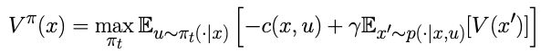
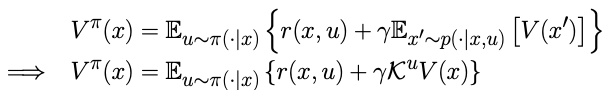
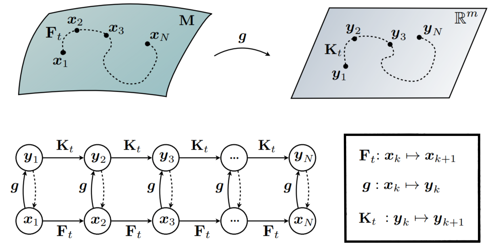
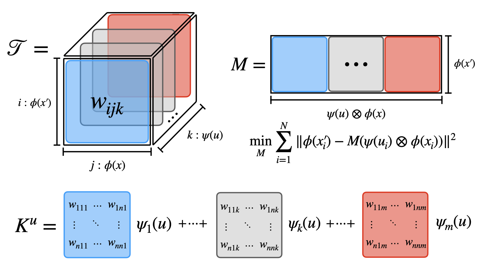
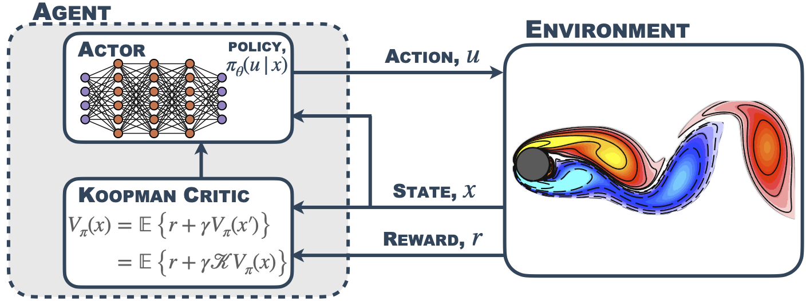
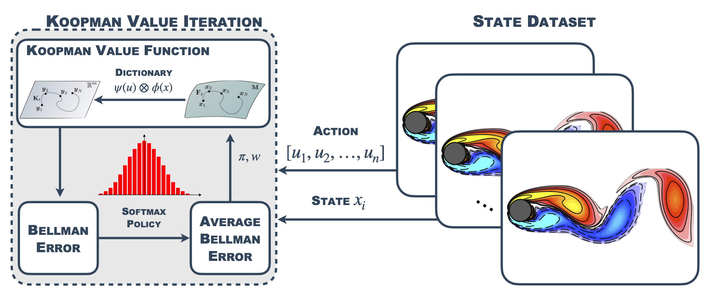
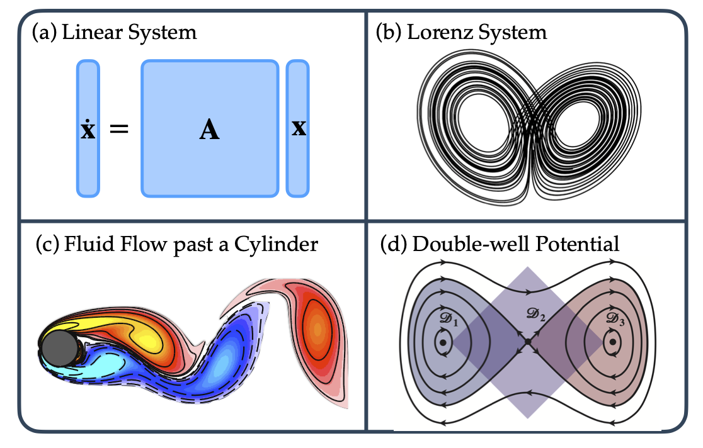
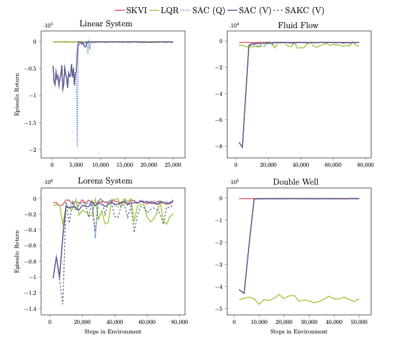

## Abstract

The Bellman equation and its continuous form, the Hamilton-Jacobi-Bellman (HJB) equation, are ubiquitous in reinforcement learning (RL) and control theory contexts due, in part, to their guaranteed convergence towards a system’s optimal value function. However, this approach has severe limitations. This paper explores the connection between the data-driven Koopman operator and Bellman Markov Decision Processes, resulting in the development of two new RL algorithms to address these limitations. In particular, we focus on Koopman operator methods that reformulate a nonlinear system by lifting into new coordinates where the dynamics become linear, and where HJB-based methods are more tractable. These transformations enable the estimation, prediction, and control of strongly nonlinear dynamics. Viewing the Bellman equation as a controlled dynamical system, the Koopman operator is able to capture the expectation of the time evolution of the value function in the given systems via linear dynamics in the lifted coordinates. By parameterizing the Koopman operator with the control actions, we construct a new _Koopman tensor_ that facilitates the estimation of the optimal value function. Then, a transformation of Bellman’s framework in terms of the Koopman tensor enables us to reformulate two max-entropy RL algorithms: soft-value iteration and soft actor-critic (SAC). This highly flexible framework can be used for deterministic or stochastic systems as well as for discrete or continuous-time dynamics. Finally, we show that these algorithms attain state-of-the-art (SOTA) performance with respect to traditional neural network-based SAC and linear quadratic regulator (LQR) baselines on three controlled dynamical systems: the Lorenz system, fluid flow past a cylinder, and a double-well potential with non-isotropic stochastic forcing. It does this all while maintaining an interpretability that shows how inputs tend to affect outputs, what we call _input-output_ interpretability.

## Koopman Reinforcement Learning

### The Construction of the Koopman Tensor

To bring the Koopman operator into modern reinforcement learning, we rely on the following key insight belying Koopman operator theory

> Non-linear dynamics can be represented in terms of the infinite-dimensional Koopman operator, acting on the space of all possible measurement functions

We then presume an infinite-horizon MDP Bellman Equation with a cost function c:



Which we then use the re-express the MDP in terms of the Koopman operator



Figuratively we hence lift the non-linear dynamics into a vector space where the the dynamics are approximately linear, and can then push forward the dynamics of the system using the Koopman operator.



For this we have to presume the existence of a Koopman invariant (function) subspace on which we can represent the dynamics of the value function using only a finite dictionary. In addition we have to presume multiplicative separation on the dictionary space in state and control. This core technique to our approach is summarized in the _Koopman Tensor_:



### Deriving Koopman-Variants of Maximum Entropy Reinforcement Learning Algorithms

Using the Koopman tensor machinery we are then able to fuse the Koopman tensor approach with existing maximum entropy reinforcement learning algorithms:

#### Soft Actor Koopman Critic



#### Soft Koopman Value Iteration



### Experimental Evaluation

The set of environments to evaluate the performance of our Koopman-infused reinforcement learning algorithms



On which we then compare our reinforcement learning algorithms with the [CleanRL]() implementations of 

* The Q-function based Soft Actor-Critic, in our graphs called _SAC (Q)_
* The Value-function based Soft Actor-Critic, in our graphs called _SAC (V)_

and the classical control baseline of the linear quadratic controller (LRQ). Giving us the following performance across environments



To briefly summarize these results:

* We reach SOTA on the linear system after only 5,000 environment steps, outpacing the Q-function based SAC
* The Soft Actor Koopman Critic (SAKC) consistently converges, showcasing adaptability and closely tracking existing SAC implementations
* The pre-trained Soft Koopman Value Iteration (SKVI) consistently achieves optimal returns alongside Soft Actor Koopman Critic, and the Soft Actor-Critic baselines

## Authors

<center>
<div class="row1">
    <div style="float:left;margin-right:20px;">
        
        <p style="text-align:center;"><a href="https://www.linkedin.com/in/preston-rozwood/">Preston Rozwood</a></p>
    </div>
    <div style="float:left;margin-right:20px;">
        
        <p style="text-align:center;"><a href="https://www.linkedin.com/in/edward-mehrez-aa316082">Edward Mehrez</a></p>
    </div>
</div>
 </center>

<br/><br/><br/><br/><br/><br/><br/><br/><br/><br/>

<div class="row2">
    <center>
    <div style="float:left;margin-right:20px;">
        
        <p style="text-align:center;"><a href="https://ludger.fyi">Ludger Paehler</a></p>
    </div>
    <div style="float:left;margin-right:20px;">
        
        <p style="text-align:center;"><a href="https://wensun.github.io">Wen Sun</a></p>
    </div>
    <div style="float:left;margin-right:20px;">
        
        <p style="text-align:center;"><a href="https://www.eigensteve.com">Steven L. Brunton</a></p>
    </div>
    </center>
</div>

<br/><br/><br/><br/><br/><br/><br/><br/><br/><br/>


## Corresponding Authors

* Preston Rozwood ([pwr36@cornell.edu](mailto:pwr36@cornell.edu?subject=KARL))
* Edward Mehrez ([ejm322@cornell.edu](mailto:ejm322@cornell.edu?subject=KARL))

## Citation

```bibtex
@inproceedings{rozwood2023koopman,
  title={Koopman-Assisted Reinforcement Learning},
  author={Rozwood, Preston and Mehrez, Edward and Paehler, Ludger
          and Sun, Wen and Brunton, Steven},
  booktitle={NeurIPS 2023 AI for Science Workshop},
  year={2023}
}
```
